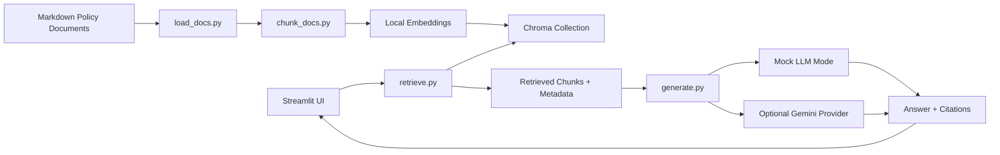

# Company Policy RAG Assistant

Policy search、citation-based answering、source inspection のための RAG assistant です。

言語: [English](README.md) | [简体中文](README.zh-CN.md) | [日本語](README.ja.md)

## 概要

Company Policy RAG Assistant は、ポリシー検索、引用付き回答、source traceability、metadata filtering を扱う軽量な Retrieval-Augmented Generation 実装です。AI tool usage、SNS operations、information security、copyright material handling、privacy protection、expense rules、incident response など、内部ガバナンスで扱われやすい文書タイプを想定しています。

リポジトリ内のサンプル文書は架空の内容であり、実在企業のデータは含まれていません。公開環境でも RAG のプロダクトフローとエンジニアリング構造を確認しやすい構成にしています。

このプロジェクトで示す内容:

- 文書 metadata を持つ Markdown policy corpus。
- 文書ロード、chunk 分割、embedding、Chroma indexing。
- category と role / department による metadata filter。
- citation を含む grounded answer。
- 検索された source chunk と metadata の表示。
- API key なしで安定した walkthrough ができる mock mode。
- English、简体中文、日本語 の回答言語選択。
- 任意の Gemini generation provider。
- 検索 context が不足している場合の refusal behavior。

## Data Handling

- リポジトリ内の文書は架空のサンプルです。
- 実在企業名、内部フロー、顧客名、talent 名、ファイル名、スクリーンショット、機密用語は含めていません。
- サンプル文書は汎用的な規程文体と public-safe metadata を使用します。
- Role と department filter は retrieval behavior を示すためのものです。Production authorization は別の access-control layer で扱います。
- 利用可能な根拠が不足している場合、assistant は選択された回答言語で refusal を返します。

## Multilingual Behavior

アプリには回答言語セレクターがあります。

- `Auto-detect from question`
- `English`
- `简体中文`
- `日本語`

Mock mode では、固定回答と refusal message が選択言語に従います。Gemini を有効化した場合、prompt は選択言語で回答し、検索された policy context のみを使うよう指示します。デフォルトの embedding model は多言語モデル `sentence-transformers/paraphrase-multilingual-MiniLM-L12-v2` です。

Refusal messages:

- English: `The current knowledge base does not contain enough evidence to answer this question.`
- 简体中文: `当前知识库没有足够依据回答这个问题。`
- 日本語: `現在のナレッジベースには、この質問に回答するための十分な根拠がありません。`

## アーキテクチャ



## Quickstart

```powershell
python -m venv .venv
.\.venv\Scripts\Activate.ps1
pip install -r requirements.txt
python -m src.build_index
streamlit run app.py
```

Gemini API key がない環境でも動作します。key が未設定の場合、アプリは自動的に mock mode で動作します。

## 任意の Gemini 設定

環境変数サンプルをコピーします。

```powershell
Copy-Item .env.example .env
```

設定:

```text
GEMINI_API_KEY=your_api_key_here
GEMINI_MODEL=gemini-2.5-flash
```

Gemini は任意の provider です。有効化した場合も、サンプル文書から検索された chunks のみが provider に送信されます。

## サンプル質問

- Can I use an AI tool to draft external social media copy?
- AIツールでSNS投稿文の下書きを作れますか？
- 炎上時の初動対応は何ですか？
- 可以复用粉丝投稿的插画做活动素材吗？
- What should an SNS operator check before posting sensitive content?
- Can we reuse fan-submitted artwork in a campaign?
- What should staff do if a talent privacy issue appears online?
- What is the first response step during a public incident?
- Can the company approve my personal vacation request?

## Policy Document Set

内蔵 corpus には 8 つの policy-style documents が含まれます。

- AI Tool Usage Policy
- SNS Operations Guideline
- Information Security Policy
- Copyright Material Policy
- Talent Privacy Protection Policy
- Fan Content Usage Policy
- Expense Policy
- Public Incident Response Manual

各文書は架空の例と汎用的な規程文体を使用しています。

## Metadata Schema

各 chunk は以下を保持します。

- `doc_id`
- `doc_title`
- `category`
- `source_file`
- `section_id`
- `section_title`
- `chunk_id`
- `chunk_index`
- `role_tags`
- `department_tags`
- `version`
- `effective_date`
- `language`
- `confidentiality`
- `keywords`

## Evaluation Samples

`eval/` フォルダには軽量な evaluation examples が含まれます。

- `policy_questions.jsonl`
- `expected_sources.jsonl`

これらのファイルは検証方針を示します。

- 期待される source が top-k retrieval に含まれるか。
- 回答に citation が含まれるか。
- out-of-scope の質問で refusal が返るか。
- metadata filter が retrieval result を変えるか。

今後、質問数、retrieval metrics、answer-quality review を追加できます。

## Repository Boundaries

このリポジトリでは、いくつかの production concerns を sample implementation の外に置いています。

- Google Drive、Slack、Confluence、Notion、社内ファイルシステムの live connector。
- 実在企業の文書、スクリーンショット、名称、運用詳細。
- login、authorization、audit logging、enforcement layer。
- automatic crawling。
- 複雑な agent workflow。
- multi-tenant SaaS packaging。
- mandatory cloud deployment。
- mandatory LLM API access。

## Repository Structure

```text
company-policy-rag-demo/
README.md
README.zh-CN.md
README.ja.md
app.py
requirements.txt
.env.example
.gitignore

data/
policies/
01_ai_tool_policy.md
02_sns_guideline.md
03_information_security_policy.md
04_copyright_material_policy.md
05_privacy_policy.md
06_fan_content_policy.md
07_expense_policy.md
08_incident_response_manual.md

src/
load_docs.py
chunk_docs.py
build_index.py
retrieve.py
generate.py
prompts.py
mock_responses.py

eval/
policy_questions.jsonl
expected_sources.jsonl

docs/
architecture.mmd
screenshots/
```

## Notes

- 内蔵 policy corpus は意図的にコンパクトにしています。
- Mock mode は安定した walkthrough のために固定回答を使用します。
- Role filter は retrieval metadata filtering です。Production authorization は別途実装します。
- Gemini integration は任意の provider path です。
