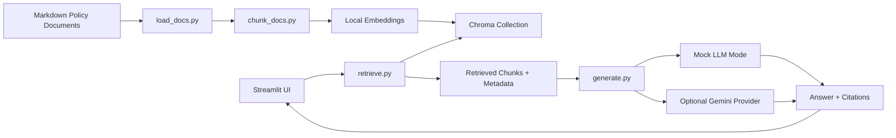

# Company Policy RAG Assistant

Policy search with retrieval, citations, and source inspection.

Live demo: [Hugging Face Space](https://huggingface.co/spaces/Boatlee/company-policy-rag-assistant)

Languages: [English](README.md) | [简体中文](README.zh-CN.md) | [日本語](README.ja.md)

## Overview

Company Policy RAG Assistant is a lightweight Retrieval-Augmented Generation implementation for policy search, citation-grounded answering, source inspection, and metadata-based retrieval. It is built around internal-governance style documents such as AI tool usage, SNS operations, information security, copyright material handling, privacy protection, expense rules, and incident response.

The repository is designed so the RAG flow can be reviewed safely. The bundled sample documents are fictional and contain no real company data.

The project demonstrates:

- A Markdown policy corpus with document-level metadata.
- Document loading, chunking, embedding, and Chroma indexing.
- Metadata filters for category and role / department.
- Retrieval-grounded answers with citations.
- Source chunk and metadata inspection.
- Mock mode for repeatable walkthroughs without an API key.
- Answer language selection for English, Simplified Chinese, and Japanese.
- Optional Gemini generation provider.
- Refusal behavior when the retrieved context is insufficient.

## Data Handling

- The bundled documents are fictional examples for this repository.
- Real company names, internal workflows, customer names, talent names, file names, screenshots, and confidential terminology are not included.
- The sample documents use generic policy language and public-safe metadata.
- Role and department filters demonstrate retrieval behavior. Production authorization would belong in a separate access-control layer.
- When the available evidence is insufficient, the assistant refuses in the selected answer language.

## Multilingual Behavior

The app includes an answer-language selector:

- `Auto-detect from question`
- `English`
- `简体中文`
- `日本語`

In mock mode, fixed answers and refusal messages follow the selected language. With Gemini enabled, the prompt instructs the model to answer in the selected language and to use only retrieved policy context. The default embedding model is multilingual: `sentence-transformers/paraphrase-multilingual-MiniLM-L12-v2`.

Refusal messages:

- English: `The current knowledge base does not contain enough evidence to answer this question.`
- 简体中文: `当前知识库没有足够依据回答这个问题。`
- 日本語: `現在のナレッジベースには、この質問に回答するための十分な根拠がありません。`

## Architecture



## Quickstart

```powershell
python -m venv .venv
.\.venv\Scripts\Activate.ps1
pip install -r requirements.txt
python -m src.build_index
streamlit run app.py
```

The app works without a Gemini API key. If no key is configured, it automatically runs in mock mode.

## Docker

```powershell
docker build -t company-policy-rag-assistant .
docker run --rm -p 7860:7860 company-policy-rag-assistant
```

Open `http://localhost:7860`.

## Optional Gemini Setup

Copy the example environment file:

```powershell
Copy-Item .env.example .env
```

Set:

```text
GEMINI_API_KEY=your_api_key_here
GEMINI_MODEL=gemini-2.5-flash
```

Gemini is optional. When enabled, only retrieved chunks from the bundled sample documents are sent to the provider.

## Example Questions

- Can I use an AI tool to draft external social media copy?
- AIツールでSNS投稿文の下書きを作れますか？
- 炎上時の初動対応は何ですか？
- 可以复用粉丝投稿的插画做活动素材吗？
- What should an SNS operator check before posting sensitive content?
- Can we reuse fan-submitted artwork in a campaign?
- What should staff do if a talent privacy issue appears online?
- What is the first response step during a public incident?
- Can the company approve my personal vacation request?

## Policy Document Set

The bundled corpus includes eight policy-style documents:

- AI Tool Usage Policy
- SNS Operations Guideline
- Information Security Policy
- Copyright Material Policy
- Talent Privacy Protection Policy
- Fan Content Usage Policy
- Expense Policy
- Public Incident Response Manual

Each document uses fictional examples and generic policy language.

## Metadata Schema

Each chunk stores:

- `doc_id`
- `doc_title`
- `category`
- `source_file`
- `section_id`
- `section_title`
- `chunk_id`
- `chunk_index`
- `role_tags`
- `department_tags`
- `version`
- `effective_date`
- `language`
- `confidentiality`
- `keywords`

## Evaluation Samples

The `eval/` folder contains lightweight evaluation examples:

- `policy_questions.jsonl`
- `expected_sources.jsonl`

These files show the intended validation approach:

- Expected source appears in top-k retrieval.
- Answer includes citations.
- Out-of-scope questions trigger refusal.
- Metadata filters change retrieval results.

The evaluation set can be expanded with more questions, retrieval metrics, and answer-quality review.

## Repository Boundaries

The repository keeps several production concerns outside the sample implementation:

- Live connectors to Google Drive, Slack, Confluence, Notion, or internal file servers.
- Real company documents, screenshots, names, and operational details.
- Login, authorization, audit logging, and enforcement layers.
- Automatic crawling.
- Complex agent workflows.
- Multi-tenant SaaS packaging.
- Mandatory cloud deployment.
- Mandatory LLM API access.

## Repository Structure

```text
company-policy-rag-demo/
README.md
README.zh-CN.md
README.ja.md
app.py
requirements.txt
.env.example
.gitignore

data/
policies/
01_ai_tool_policy.md
02_sns_guideline.md
03_information_security_policy.md
04_copyright_material_policy.md
05_privacy_policy.md
06_fan_content_policy.md
07_expense_policy.md
08_incident_response_manual.md

src/
load_docs.py
chunk_docs.py
build_index.py
retrieve.py
generate.py
prompts.py
mock_responses.py

eval/
policy_questions.jsonl
expected_sources.jsonl

docs/
architecture.mmd
screenshots/
```

## Notes

- The bundled policy corpus is intentionally compact.
- Mock mode uses fixed answers for predictable walkthroughs.
- Role filtering is retrieval metadata filtering; production authorization would be implemented separately.
- Gemini integration is an optional provider path.

## License

MIT License. See [LICENSE](LICENSE).
