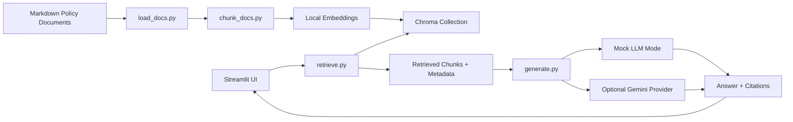

# Company Policy RAG Assistant

面向制度检索、引用式回答和来源追溯的 Policy RAG Assistant。

语言版本：[English](README.md) | [简体中文](README.zh-CN.md) | [日本語](README.ja.md)

## 项目概述

Company Policy RAG Assistant 是一个轻量级 Retrieval-Augmented Generation 实现，覆盖制度检索、引用式回答、来源追溯和 metadata 筛选。项目围绕企业内部治理常见文档类型展开，包括 AI 工具使用、SNS 运营、信息安全、版权素材处理、隐私保护、费用规则和事故应对。

仓库中的示例文档为虚构内容，不包含真实公司数据，方便在公开环境中安全查看 RAG 产品流程和工程结构。

这个项目展示：

- 带文档级 metadata 的 Markdown policy corpus。
- 文档加载、chunk 切分、embedding 和 Chroma 向量索引。
- 基于 category 与 role / department 的 metadata filter。
- 带 citation 的 grounded answer。
- 检索原文 chunk 和 metadata 展示。
- 无 API key 也能稳定 walkthrough 的 mock mode。
- 支持 English、简体中文、日本語 的回答语言选择。
- 可选 Gemini generation provider。
- 检索上下文不足时的拒答行为。

## 数据处理

- 仓库中的文档是虚构示例。
- 真实公司名、内部流程、客户名、talent 名称、文件名、截图和保密术语不包含在内。
- 示例文档使用通用制度语言和 public-safe metadata。
- Role 和 department filter 用于展示检索行为；生产级授权应由独立 access-control layer 处理。
- 当可用依据不足时，助手会按选择的回答语言拒答。

## 多语言行为

应用提供回答语言选择：

- `Auto-detect from question`
- `English`
- `简体中文`
- `日本語`

Mock mode 下，固定回答和拒答文案都会跟随所选语言。启用 Gemini 时，prompt 会要求模型使用所选语言回答，并且只基于检索到的 policy context。默认 embedding 模型使用多语言模型：`sentence-transformers/paraphrase-multilingual-MiniLM-L12-v2`。

拒答文案：

- English: `The current knowledge base does not contain enough evidence to answer this question.`
- 简体中文: `当前知识库没有足够依据回答这个问题。`
- 日本語: `現在のナレッジベースには、この質問に回答するための十分な根拠がありません。`

## 架构



## 快速开始

```powershell
python -m venv .venv
.\.venv\Scripts\Activate.ps1
pip install -r requirements.txt
python -m src.build_index
streamlit run app.py
```

没有 Gemini API key 也可以运行。未配置 key 时，应用会自动进入 mock mode。

## 可选 Gemini 配置

复制环境变量样例：

```powershell
Copy-Item .env.example .env
```

设置：

```text
GEMINI_API_KEY=your_api_key_here
GEMINI_MODEL=gemini-2.5-flash
```

Gemini 是可选 provider。启用时，只会把从示例文档中检索到的 chunks 发送给模型。

## 示例问题

- Can I use an AI tool to draft external social media copy?
- AIツールでSNS投稿文の下書きを作れますか？
- 炎上時の初動対応は何ですか？
- 可以复用粉丝投稿的插画做活动素材吗？
- What should an SNS operator check before posting sensitive content?
- Can we reuse fan-submitted artwork in a campaign?
- What should staff do if a talent privacy issue appears online?
- What is the first response step during a public incident?
- Can the company approve my personal vacation request?

## 文档集

内置 corpus 包含 8 份 policy-style documents：

- AI Tool Usage Policy
- SNS Operations Guideline
- Information Security Policy
- Copyright Material Policy
- Talent Privacy Protection Policy
- Fan Content Usage Policy
- Expense Policy
- Public Incident Response Manual

每份文档都使用虚构示例和通用制度语言。

## Metadata Schema

每个 chunk 存储：

- `doc_id`
- `doc_title`
- `category`
- `source_file`
- `section_id`
- `section_title`
- `chunk_id`
- `chunk_index`
- `role_tags`
- `department_tags`
- `version`
- `effective_date`
- `language`
- `confidentiality`
- `keywords`

## Evaluation Samples

`eval/` 文件夹包含轻量级 evaluation examples：

- `policy_questions.jsonl`
- `expected_sources.jsonl`

这些文件用于展示验证思路：

- 预期来源是否出现在 top-k 检索结果中。
- 回答是否包含 citation。
- out-of-scope 问题是否触发拒答。
- metadata filter 是否改变检索结果。

后续可以扩展更多问题、retrieval metrics 和 answer-quality review。

## 仓库边界

这个仓库将若干生产化模块留在 sample implementation 之外：

- Google Drive、Slack、Confluence、Notion 或内部文件系统的 live connector。
- 真实公司文档、截图、名称和运营细节。
- 登录、授权、审计日志和 enforcement layer。
- 自动爬虫。
- 复杂 agent workflow。
- 多租户 SaaS 包装。
- 强制云端部署。
- 强制真实 LLM API 接入。

## 项目结构

```text
company-policy-rag-demo/
README.md
README.zh-CN.md
README.ja.md
app.py
requirements.txt
.env.example
.gitignore

data/
policies/
01_ai_tool_policy.md
02_sns_guideline.md
03_information_security_policy.md
04_copyright_material_policy.md
05_privacy_policy.md
06_fan_content_policy.md
07_expense_policy.md
08_incident_response_manual.md

src/
load_docs.py
chunk_docs.py
build_index.py
retrieve.py
generate.py
prompts.py
mock_responses.py

eval/
policy_questions.jsonl
expected_sources.jsonl

docs/
architecture.mmd
screenshots/
```

## 说明

- 内置 policy corpus 刻意保持紧凑。
- Mock mode 使用固定回答，便于稳定 walkthrough。
- Role filter 是 retrieval metadata filtering；生产级授权应独立实现。
- Gemini integration 是可选 provider path。

## License

MIT License. See [LICENSE](LICENSE).
